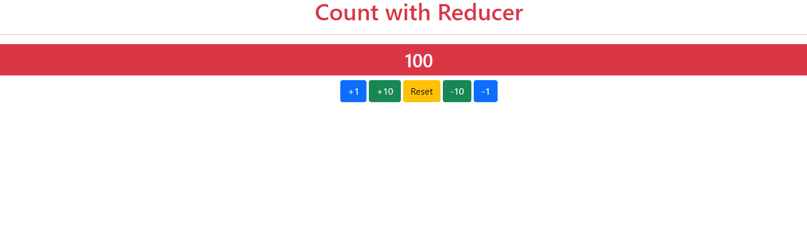

# **Counter with useReducer** :zero: :one: :two: :three: :four:

---

_Learning To Use The Usereducer Hook By Creating A Counter and bootstrap with React Js_

  

---

---

[WEB-SITE](https://countreducer.netlify.app/ 'WEB-SITE')

  

---
